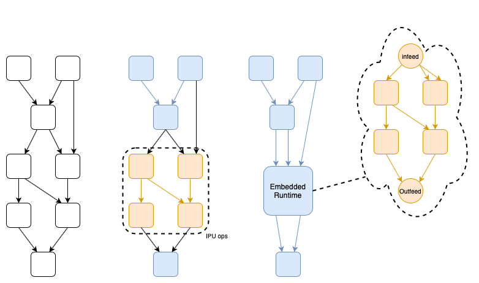
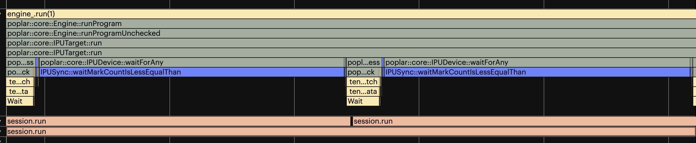
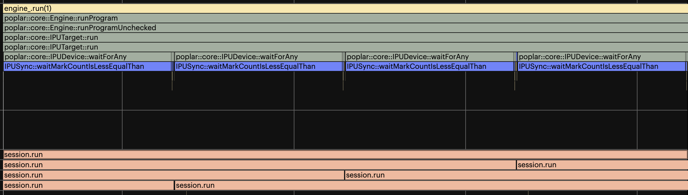
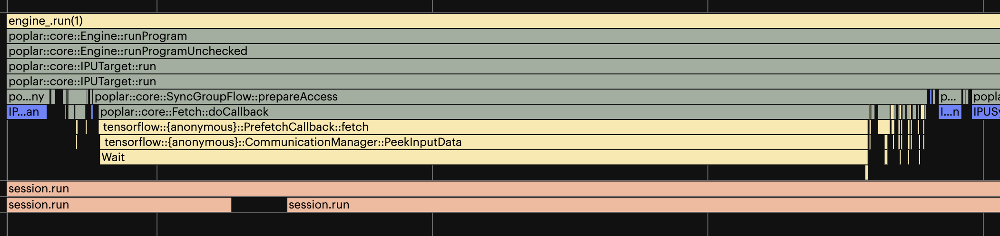
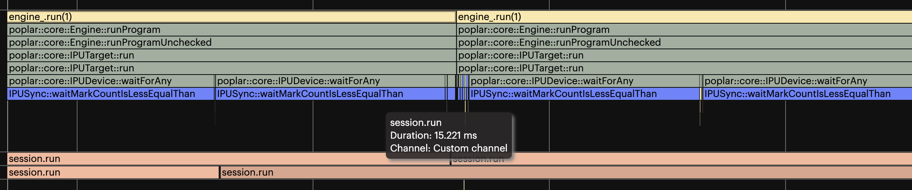

IPU embedded application runtime
--------------------------------

The embedded application runtime allows you to run a compiled TensorFlow
executable as part of a TensorFlow graph. This enables embedding the executable
in a larger and more complex system, while also utilising IPUs. This runtime
appears in the TensorFlow graph as a custom CPU operation.

    An arbitrary compute graph (left) with a possible IPU subgraph identified (middle), and a possible embedding of an executable (right)

The executable can be built with infeeds and outfeeds that maximise the
performance of the compiled application on the IPU. The feeds are presented to
the TensorFlow graph as standard inputs and outputs on the call operation.
These can be connected to other TensorFlow operations as part of a larger
graph.

Any mutable variables used inside the application are passed once in the call
to start. This minimises redundant communication with the IPUs.

Applications access this functionality through the
:py:func:`tensorflow.python.ipu.embedded_runtime.embedded_runtime_start` and
:py:func:`tensorflow.python.ipu.embedded_runtime.embedded_runtime_call` helper
functions.

Usage
~~~~~

The IPU embedded application runtime relies on instances of the
``RuntimeContext`` class to coordinate the startup and calls to the Poplar
engine. This object is created with a call to
:py:func:`tensorflow.python.ipu.embedded_runtime.embedded_runtime_start`.

.. code-block:: python

  from tensorflow.python.ipu import embedded_runtime
  ...
  context = embedded_runtime.embedded_runtime_start(
    poplar_exec_filepath, startup_inputs, engine_name)

The `startup_inputs` can be a list of tensors or a name-value dictionary of
tensors, where the names correspond to the name of the XLA inputs.

The created object is then passed to the call site where the
:py:meth:`tensorflow.python.ipu.embedded_runtime.embedded_runtime_call`
function can be called. The context object ensures all appropriate metadata is
passed, and control dependencies are created.

.. code-block:: python

  ...
  results = embedded_runtime.embedded_runtime_call(
    call_inputs, context)
  session.run(results, feed_dict={...})

Once the IPU embedded application runtime has been created and used within the
session, the Poplar engine will be running in a background thread. This thread
can outlive the TensorFlow session.

Pipelining and I/O tiles
~~~~~~~~~~~~~~~~~~~~~~~~

When running a pipelined application, or an application with I/O tiles, we must
handle the additional layer of pipelining. This is a result of there being
multiple batches of data resident in the device at the same time.

There are two ways to manage this. The first is by submitting multiple requests
in parallel. The second is to provide a maximum timeout that the application
should wait for additional data.

Parallel requests
_________________

To ensure the application isn't starved of data you can submit multiple
batches of data in parallel in multiple threads. These will be enqueued and
processed as early as possible by the device.

When an application is pipelined, these parallel batches of data will overlap
in time as they are processed by the devices. This improves the overall
utilisation of the devices and minimises the batch latency.

    Embedded runtime with two threads and some waiting

    The same application with four threads and no waiting

Timeout
_______

When the application is pipelined or using I/O tiles, and data starvation might
occur, the timeout option allows you to set an upperbound on the time the IPU
will wait for data.

When TensorFlow receives a Poplar callback a timer is started. When the
timer reaches the defined timeout, a "dummy" batch of data is passed to the
device. This unblocks any pending batches that are in the device.

    An embedded runtime application triggering a 500us timeout

Engine restarts
_______________

The number of batches to process in an application is a compile-time decision.
However, you might later deliver more batches at runtime than compiled for. If
this happens, the Poplar engine will be restarted. A restart blocks enqueued
items from being processed, temporarily increasing latency.

To mitigate this, we recommend compiling the application to process as many
batches as required before it terminates. If the number of batches is unknown,
choose a value large enough to minimise this.

    An embedded runtime application triggering an engine restart causing increased latency

Example
~~~~~~~~

This example creates a very simple IPU program that doubles the input tensor.

.. literalinclude:: embedded_application_runtime_example.py
  :language: python
  :linenos:

Download :download:`embedded_application_runtime_example.py`

.. _ea_runtime_error_handling:

Error Handling
~~~~~~~~~~~~~~

.. note::

  This section only applies to the execution using the IPU embedded application
  runtime. If you are using the XLA/Poplar runtime see
  :ref:`xla_runtime_error_handling`.

Runtime errors
______________

These errors and exceptions occur when running a Poplar program. The full list
of all the exceptions and their meanings can be found in the Poplar
documentation in the `Exceptions <https://docs.graphcore.ai/projects/poplar-api/page/poplar/execution/exceptions.html>`__
section of the Poplar API reference manual.

These runtime errors are handled in the following manner:

* ``application_runtime_error``

  - A ``tensorflow.errors.InternalError`` error is raised.
  - The error message contains the reason why the error occurred.
  - An IPU reset will be performed before the next execution.
  - All requests which have already been enqueued before the exception occurred will return the error.
  - Any new requests will be processed after the IPU reset is complete.

* ``recoverable_runtime_error`` with a recovery action of "``poplar::RecoveryAction::IPU_RESET``"

  - A ``tensorflow.errors.InternalError`` error is raised.
  - The error message contains the reason why the error occurred.
  - An IPU reset will be performed before the next execution.
  - All requests which have already been enqueued before the exception occurred will return the error.
  - Any new requests will be processed after the IPU reset is complete.

* Unknown runtime errors

  - A ``tensorflow.errors.Unknown``  error is raised.
  - The error message might contain the reason why the error occurred.
  - When these errors occur manual intervention is required before the system is
    operational again.
  - The IPU will not be reset and all requests will return the error.

* All other runtime errors

  - A ``tensorflow.errors.InternalError`` error is raised.
  - The error message might contain the reason why the error occurred.
  - When these errors occur manual intervention might be required before the
    system is operational again.
  - The error message might contain a required recovery action.
  - The IPU will not be reset and all requests will return the error.
