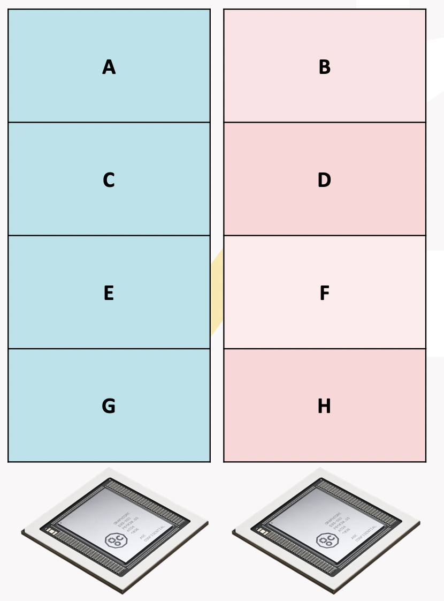
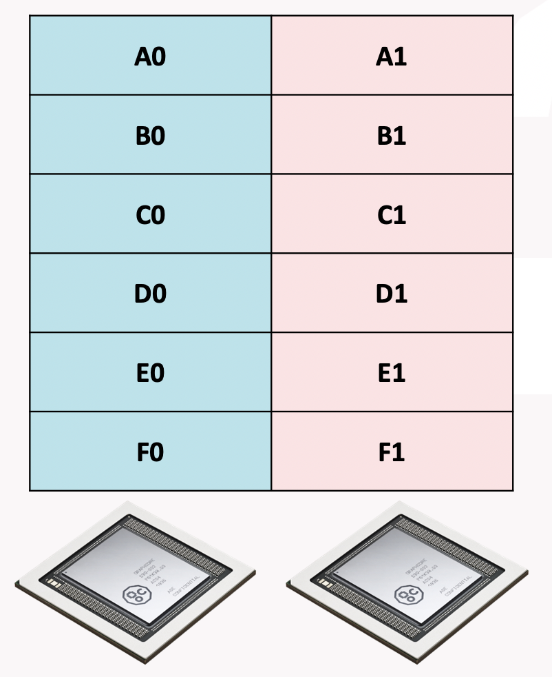

IPU host embeddings
-------------------

An embedding table is a table in a model or compute graph that
supports a lookup operation. For more details see the TensorFlow
documentation on `tf.nn.embedding_lookup
<https://www.tensorflow.org/api_docs/python/tf/nn/embedding_lookup>`_.

On the IPU, large embeddings can be stored in host memory with the
CPU performing the lookup operations (and update operations during
training) in conjunction with the IPU. This functionality supports
both inference and training.

During execution the IPU will synchronize with the host and send
indices (and possibly update values) to the host CPU. The CPU will
then perform the lookup or update operation in a callback
before returning the result to the IPU. The IPU will then carry on
execution.

Applications access this functionality through the
:py:class:`tensorflow.python.ipu.embedding_ops.HostEmbedding` class and the
:py:func:`tensorflow.python.ipu.embedding_ops.create_host_embedding` helper
function. Optimisation of the host embedding is described in the
:py:class:`tensorflow.python.ipu.embedding_ops.HostEmbeddingOptimizerSpec`
class, which currently only supports SGD with a constant learning rate.

.. note::

  IPU host embeddings are not recommended for use in pipelines and will
  likely decrease the pipeline's parallel efficiency.

Usage
~~~~~
IPU host embeddings rely on instances of the ``HostEmbedding`` class to
coordinate the communication between the host and device. This object is created
with a call to
:py:func:`tensorflow.python.ipu.embedding_ops.create_host_embedding`. The
created object is then passed to the user model where the
:py:meth:`tensorflow.python.ipu.embedding_ops.HostEmbedding.lookup` method can
be called with a similar API to ``tf.nn.embedding_lookup``.

Once the IPU host embedding has been created and used within the model, the
object must be "registered" with the session using the context manager created
by (:py:meth:`tensorflow.python.ipu.embedding_ops.HostEmbedding.register`).
If TensorFlow session is not called within this context, TensorFlow will not
configure the underlying Poplar engine correctly and the model execution will
fail.

Example
~~~~~~~~

.. literalinclude:: host_embedding_example.py
  :language: python
  :linenos:

Download :download:`host_embedding_example.py`

Experimental functionality: IPU embeddings in remote buffers
~~~~~~~~~~~~~~~~~~~~~~~~~~~~~~~~~~~~~~~~~~~~~~~~~~~~~~~~~~~~

As an alternative to host embeddings, there is experimental
functionality to store embedding tables in remote buffers in Streaming Memory
(that is, off-chip memory directly accessed by the IPU). In this case, the
IPU performs the lookup/update operations directly on the remote
buffers, and the host CPU is not involved.

Setting the :ref:`experimental.enable_remote_buffer_embedding
<experimental.enable_remote_buffer_embedding>` option on an
:py:class:`~tensorflow.python.ipu.config.IPUConfig` to ``True`` (defaults to
``False``) and then configuring the IPU system with that ``IPUConfig`` will
use IPU embeddings in remote buffers, globally.

.. note::

  This option is experimental, and may be changed or removed in future
  releases.

Partitioning strategies
#######################

When using IPU embeddings in remote buffers together with
data-parallel replication, the embedding table is not duplicated for
each replica. Instead, a single copy of the table is shared between
replicas to make the most of available memory. However, each replica
only has access to a distinct memory space so the table is
partitioned into chunks between the replicas (this holds even on
hardware platforms where IPUs share physical
external memory).

The way the table is split between the memory attached to each replica
is determined by the partitioning strategy. Two
partitioning strategies are available.
These are the :ref:`token strategy <token strategy>` and the :ref:`encoding strategy <encoding strategy>`.
Each has trade-offs and the
choice of strategy will depend on the application. The partition
strategy is set via the ``partition_strategy`` keyword argument of
:py:func:`~tensorflow.python.ipu.embedding_ops.create_host_embedding`.

Token strategy
**************

The token strategy partitions the embedding on the
token axis. There will be ``ceil(t/r)`` whole tokens on each replica,
where ``t`` is the token count and ``r`` is the replica count.

    Host embedding token strategy

When this strategy is used, cross-replica operations are required to
allow each replica to perform a lookup or update across the whole
table (each replica's portion of the whole embedding table is private
to that replica). Below is the pseudo-code, with explicit types and
static shapes, for how this is implemented:

.. code-block:: none
  :linenos:

  // Pseudo-code assuming we have table size `t`, and replica count `r`.
  f16[14, 64] global_lookup(
    local_table : f16[ceil(t/r), 64]
    global_indices : i32[14]
  ):
    // The unique replica ID for "this" replica.
    replica_id = i32[] get-replica-id

    // Distribute the indices to all devices.
    indices = all-gather(indices) : i32[r, 14]

    // Scale the indices down by the replication factor. Indices not meant for
    // this replica will map to a valid, but incorrect index.
    local_indices = indices / r : i32[r, 14]

    // Gather on the local embedding region.
    result = lookup(embedding, indices) : f16[r, 14, 64]

    // The mask of which indices are valid.
    mask = (indices % r) == replica_id : bool[r, 14]

    // Zero out the invalid regions of the result
    result = select(result, 0, mask) : f16[r, 14, 64]

    // Reduce scatter sum the masked result tensor. The zeroed regions of the
    // result tensor ensure that invalid values are ignore and each replica has
    // the correct result.
    result = reduce-scatter-sum(result) : f16[1, 14, 64]

    // Reshape to the expected shape
    return reshape(result), shape=[14, 64] : f16[14, 64]

Encoding strategy
*****************

The encoding strategy will partition the embedding on the encoding
axis. There will be ``ceil(1/r)`` of every tokens on each replica,
where ``r`` is the replica count. This means
for a given token every replica will store ``ceil(e/r)`` elements, where ``e``
is the element count for a single token.

    Host embedding encoding strategy

When this strategy is used, cross-replica operations are required to
allow each replica to perform a lookup or update across the whole
table (each replica's portion of the whole embedding table is private
to that replica). Below is the pseudo-code, with explicit types and
static shapes, for how this is implemented:

.. code-block:: none
  :linenos:

  // Pseudo-code assuming we have table size `t`, replica count `r`, and
  // encoding size `e`.
  f16[14, e] global_lookup(
    local_table : f16[t, ceil(e/r)]
    global_indices : i32[14]
  ):
    // Distribute the indices to all devices
    indices = all-gather(global_indices) : i32[r, 14]

    // Gather on the local embedding
    result = lookup(local_embedding, indices) : f16[r, 14, ceil(e/r)]

    // Communicate the relevant parts of the embedding to their respective
    // replicas. This distributes the ith slice in the outermost dimension to
    // ith replica.
    result = all-to-all(result, slice_dim=2, concat_dim=3) : f16[r, 14, ceil(e/r)]

    // Transpose the dimensions back into the correct order.
    result = transpose(result), permutation=[1, 0, 2] : f16[14, r, ceil(e/r)]

    // Flatten the innermost dimensions
    result = flatten(result), begin=1, end=2 : f16[14, r*ceil(e/r)]

    // Slice off the excess padding on the encoding
    return slice(result), dim=1, begin=0, end=e : f16[14, e]

Choosing a strategy for your application
****************************************

The choice of partitioning strategy is application dependent and the
best way to determine the best strategy is to profile multiple strategies.

As a general rule, the token strategy is used when the encoding is much
smaller than the token count. An example application for this would be
language models where the vocabulary size is much larger than the encoding.

Conversely, the encoding strategy is used when the token count is
small and the encoding is large enough to be split.
This avoids a large amount of very small communication.
An example application for this would be game playing models,
where a small numbers of available actions are encoded in an embedding.
