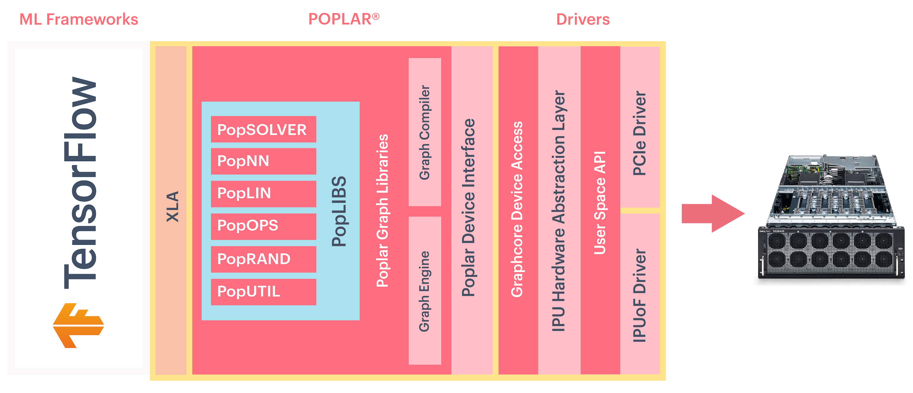

Introduction
------------

The purpose of this document is to introduce the TensorFlow framework from the
perspective of developing and training models for the IPU. It assumes you have
some knowledge of machine learning and TensorFlow.

For more information about the IPU architecture, abstract programming model and tools, as well as algorithmic techniques, refer to the :external+ipu-programmers-guide:doc:`index`. The :external+memory-performan-optimisation:doc:`index` contains guidelines for optimising performance in machine learning models running on the IPU.

.. note:: This document is for TensorFlow 2. For information on TensorFlow 1
          please refer to `Targeting the IPU from TensorFlow 1
          <https://docs.graphcore.ai/projects/tensorflow1-user-guide/>`_.

See the `Getting Started" guide for your IPU system <https://docs.graphcore.ai/en/latest/getting-started.html>`__ in the
`Graphcore documentation <https://docs.graphcore.ai>`_
for information on installing the Poplar SDK and refer to the :external+tensorflow1-quick-start:doc:`index` for installing TensorFlow 1 and running a simple application.

TensorFlow is a powerful graph-modelling framework that can be used for the
development, training and deployment of deep learning models. In the Graphcore
software stack, TensorFlow sits at the highest level of abstraction. Poplar
and PopLibs provide a software interface to operations running on the IPU.
XLA (Accelerated Linear Algebra) is a domain-specific compiler for linear
algebra that can accelerate TensorFlow models.
TensorFlow graphs are compiled into Poplar executables using our XLA backend.

    TensorFlow abstraction in relation to Poplar and the IPU

There are two main differences in the Graphcore implementation of TensorFlow:

* Some machine-learning ops are optimised for the IPU
  hardware. For example, our custom dropout op is designed to use less memory
  by not storing the dropout mask between forward and backward passes.
* It provides extra IPU-specific functions, such as those for selecting and
  configuring IPUs.

Implementing programs at the framework level is relatively independent of
the underlying hardware. The process of defining a graph and
its components (for example, how a convolutional layer is defined) is largely the
same when targeting the IPU.

There are a small number of changes that you need to make to your TensorFlow
code, when constructing and executing a model, in order to target the IPU
efficiently. These include IPU-specific API configurations, model parallelism,
error logging and report generation, as well as strategies for dealing with
out-of-memory (OOM) issues.

These will be described in the appropriate sections of this document.

.. note:: Many of the sections are shared with the TensorFlow 1 version of this
          document. The function `ipu_compiler.compile()` is used within an IPU
          device scope when using `tf.compat.v1.Session`. It is not required
          when using the `IPUStrategy`.

Document overview
~~~~~~~~~~~~~~~~~

* The first section provides information about :any:`selecting specific IPU
  <device_selection>` hardware and configuring the code to run on it.
* The `IPUStrategy` class and its use in Keras is described in the
  section on :any:`support for TensorFlow 2 <targeting_tf2>`
* The next section describes executable caches and pre-compilation of
  executables.
* The following sections provide information on various methods related to
  training a model on the IPU.
* The next few sections provide information on IPU-specific features.
* Finally, there are reference chapters describing the API and supported operators.

You can find further information on porting a TensorFlow program to the IPU and
parallelising it, in our `TensorFlow technical notes
<https://docs.graphcore.ai/en/latest/#tensorflow>`_.
