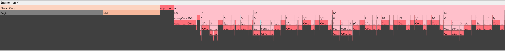
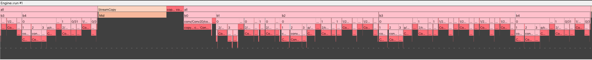
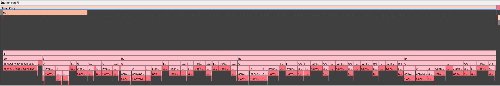

Efficient IPU I/O
-----------------
When developing applications for the IPU, maximising the I/O performance is
important. If an application is I/O-bound, after optimisation of the host data
loading, then you can explore further optimisations of the movement of data
into the IPU. This chapter will cover two options that can improve I/O
performance.

Prefetch elements
~~~~~~~~~~~~~~~~~
The option to prefetch multiple dataset elements allows TensorFlow and Poplar
to move input data logically closer to the IPU before it is needed. This can
be in the Streaming Memory (DRAM attached to the IPU-Machine, for example an IPU-M2000 or a Bow-2000). A symptom of data
not being available to the IPU when required is large ``StreamCopyBegin``
programs in the PopVision execution
trace.

    An application with a long wait for ``StreamCopyBegin``.

You can enable and set prefetch using the ``prefetch_depth`` option on the
:class:`~tensorflow.python.ipu.IPUInfeedQueue` constructor or the IPU Keras
API functions. Setting this option to a value greater than `1` will instruct
TensorFlow and Poplar to move up to ``prefetch_depth`` dataset elements into
a staging area near the IPU.

    The same application without a long wait for ``StreamCopyBegin``.

.. _i-o-tiles:

I/O Tiles
~~~~~~~~~
The option to designate a number of IPU-tiles to be "I/O tiles" allows
TensorFlow to construct the Poplar graph so that the data transfer and the
computation can overlap in time. This is useful when the ``StreamCopyMid`` is
taking a significant proportion of the application's runtime and blocking
computation.

.. note::
  This will only overlap I/O with computation for a single IPU application or
  a pipelined application using the grouped schedule. See
  :numref:`pipelined_training` for more detail.

    An application serialised on a long ``StreamCopyMid``.

You can set the number of I/O tiles to use during execution when configuring
the IPU. This is set using the :ref:`io_tiles.num_io_tiles <io_tiles.num_io_tiles>`
configuration option of the :py:class:`~tensorflow.python.ipu.utils.IPUConfig`:

.. code-block:: python

  from tensorflow.python import ipu
  ...
  config = ipu.config.IPUConfig()
  config.io_tiles.num_io_tiles = 128
  config.io_tiles.place_ops_on_io_tiles = True

    The same application with the ``StreamCopyMid`` parallelised.

You should carefully tune the number of IPU-tiles designated to be I/O tiles
because these tiles cannot participate in the computation. This means that a
very large number of I/O tiles can cause performance regressions in the main
computation. However, too few I/O tiles can cause the transferred tensors to
not fit in the available tile memory. Therefore, this may require some
experimentation to find the best value for a specific application.
