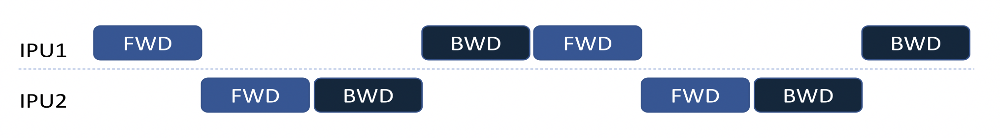

Training a model
----------------

TensorFlow XLA and Poplar provide the ability to combine an entire training
graph into a single operation in the TensorFlow graph.  This accelerates
training by removing the need to make calls to the IPU hardware for each
operation in the graph.

However, if the Python code with the training pass is called multiple
times, once for each batch in the training data set, then there is still
the overhead of calling the hardware for each batch.

The Graphcore IPU support for TensorFlow provides three mechanisms to
improve the training performance: training loops, data set feeds, and
replicated graphs.

Training loops, data sets and feed queues
~~~~~~~~~~~~~~~~~~~~~~~~~~~~~~~~~~~~~~~~~

By placing the training operations inside a loop, they can be executed multiple
times without returning control to the host.  It is possible to use a standard
TensorFlow ``while_loop`` operation to wrap the training operation, but the IPU
library provides a convenient and feature rich version.

Normally when TensorFlow runs, operations which are not inside a loop will be
executed once, and those operations will return one or more tensors with fixed
values.  However, when a training operation is placed into a loop, the inputs
to that training operation need to provide a stream of values.  Standard
TensorFlow Python feed dictionaries cannot provide data in this form, so when
training in a loop, data must be fed from a TensorFlow DataSet.

More information can be found on the DataSet class and its use in normal
operation at https://www.tensorflow.org/guide/performance/datasets. TensorFlow
provides many pre-configured DataSets for use in training models.  See the site
https://www.tensorflow.org/datasets.

To construct a system that will train in a loop, you will need to do the
following:

* Wrap your optimiser training operation in a loop.
* Create an ``IPUInfeedQueue`` to feed data to that loop.
* Create an ``IPUOutfeedQueue`` to take results out of that loop.
* Create a TensorFlow DataSet to provide data to the input queue.

The following example shows how to construct a trivial DataSet, attach it to
a model using in ``IPUInfeedQueue``, feed results into an ``IPUOutfeedQueue``, and
construct a loop.

.. literalinclude:: perf_training_example.py
  :language: python
  :linenos:

In this case the DataSet is a trivial one.  It constructs a base DataSet from a
single TensorFlow constant, and then maps the output of that DataSet into a
pair of tensors.  It then arranges for the DataSet to be repeated indefinitely.

After the DataSet is constructed, the two data feed queues are constructed. The
``IPUInfeedQueue`` takes the DataSet as a parameter, along with a name.  Every
queue in the system must have a unique name.

The ``IPUOutfeedQueue`` has extra options to control how it collects and outputs
the data sent to it.  None of these are used in this example.

Now that we have the DataSet and the queues for getting data in and out of the
device-side code, we can construct the device-side part of the model.  In this
example, the ``body`` function constructs a very simple model, which does not
even have an optimiser.  It takes the two data samples which will be provided
by the DataSet, and performs some simple maths on them, and inserts the
results into the output queue.

Typically, in this function, the full ML model would be constructed and a
TensorFlow ``Optimizer`` would be used to generate a backward pass and variable
update operations.  The returned data would typically be a loss value, or
perhaps nothing at all if all we do is call the training operation.

The ``my_net`` function is where the ``loops.repeat`` function is called.  This
wraps the ``body`` function in a loop.  It takes as the first parameter the
number of times to execute the operation, in this case 10.  It also takes the
function that generated the body of the loop, in this case the function
``body``, a list of extra parameters to pass to the body, in this case none,
and finally the infeed queue which will feed data into the loop.

Next we create an IPU scope at the top level and call ``ipu_compiler.compile``
passing the ``my_net`` function, to create the training loop in the main graph.
The output of the ``ipu_compiler.compile`` will be an operation that can be
called to execute the training loop.

Finally, we create an operation which can be used to fetch results from the
outfeed queue.  Note that it isn't necessary to use an outfeed queue if you do
not wish to receive any per-sample output from the training loop.  If all you
require is the final value of a tensor, then it can be output normally without
the need for a queue.

If you run this example then you will find that the result is a Python
dictionary containing two numpy arrays.  The first is the ``d1`` array and
will contain `x1 + x2` for each iteration in the loop.  The second is the ``d2``
array and will contain `x1 - x2` for each iteration in the loop.

See entries in the :ref:`api-section` for more details.

.. _replicated_graphs:

Replicated graphs
~~~~~~~~~~~~~~~~~

To improve performance, multiple IPUs can be configured to run in a data
parallel mode.  The graph is said to be replicated across multiple IPUs.
See the `Poplar and Poplibs User Guide
<https://documents.graphcore.ai/documents/UG1/latest>`_ for more background
about replicated graphs.

**Note:** replicated graphs are not supported when running on an IPU Model.

Selecting the number of replicas
________________________________

During system configuration, you specify the number of IPUs for the
TensorFlow device using the ``auto_select_ipus()`` function, or the
``select_ipus()`` function.

A graph can be sharded across multiple IPUs (model parallelism), and then
replicated across IPUs (data parallelism).  When specifying the number of IPUs
in the system, you must specify a multiple of the number of shards used
by the graph.

For instance, if a graph is sharded over two IPUs, and you specify eight IPUs
to the ``auto_select_ipus`` function, then the graph will be replicated four
times.

Data feeds
__________

When used with a replicated graph, the ``IPUInfeedQueue`` and
``IPUOutfeedQueue`` classes require the number of
replicas to be passed into the constructor in the ``replication_factor``
parameter.

Performing parameter updates
____________________________

Each replica maintains its own copy of the graph, but during training it is
important to ensure that the graph parameters are updated so that they are
in sync across replicas.

A wrapper for standard TensorFlow optimisers is used to add extra operations to
the parameter update nodes in the graph to average updates across replicas. It
is called ``CrossReplicaOptimizer``.  See the :ref:`api-section` for more
details.

Pipelined training
~~~~~~~~~~~~~~~~~~

The IPU pipeline API creates a series of computational stages, where the
outputs of one stage are the inputs to the next one. These stages are then
executed in parallel across multiple IPUs. This approach can be used to
split the model where layer(s) are executed on different IPUs.

This improves utilisation of the hardware when a model is too large to fit
into a single IPU and must be sharded across multiple IPUs.

Each of the stages is a set of operations, and is described using a Python
function, in much the same way as the ``ipu.compile`` takes a function that
describes the graph to compile onto the IPU.

See the :ref:`api-section` for more specific details of the ``ipu.pipeline``
operator.

The pipeline API requires data inputs to be provided by a ``tf.DataSet``
source connected via an infeed operation.  If you would like per-sample
output, for instance the loss, then this will have to be provided by an outfeed
operation.

The computational stages can be interleaved on the devices in two different
ways as described by the ``pipeline_schedule`` parameter.  By default the API
will use the ``PipelineSchedule.Grouped`` mode, where the forward passes are
grouped together, and the backward passes are grouped together.  The
alternative is the ``PipelineSchedule.Interleaved``, where the forward and
backward passes are interleaved, so that fewer activations need to be stored.

Sharded scheduling
__________________

Interleaved scheduling
______________________

.. figure:: figures/interleaved_pipeline.png
    :width: 95%
    :alt: Interleaved pipeline schedule illustration
    :align: center

Grouped scheduling
__________________

.. figure:: figures/grouped_pipeline.png
    :width: 95%
    :alt: Grouped pipeline schedule illustration
    :align: center

Pipeline stage inputs and outputs
_________________________________

The first pipeline stage needs to have inputs which are a combination of the
tensors from the DataSet, and the tensors given as arguments to the
pipeline operation.  Any data which changes for every sample or minibatch of
the input should be included in the DataSet, while data which can vary only
on each run of the pipeline should be passed as arguments to the pipeline
operation.  Parameters like the learning rate would fit into this latter case.

Every subsequent pipeline stage must have its inputs as the outputs of the
previous stage.  Note that things like the learning rate must be threaded
through each pipeline stage until they are used.

Applying an optimiser to the graph
__________________________________

The optimiser must be applied by creating it in a special optimiser function
and then returning a handle to it from that function.  The function is passed
into the ``optimizer_function`` argument of the pipeline operation.

When a pipeline is running it will accumulate the gradients from each step of
the pipeline and only apply the updates to the graph parameters at the end of
each pipeline run, given by the ``pipeline_depth`` parameter. Consequently it is
important for the system to have more knowledge of the optimiser and so it
must be given to the pipeline operator using this function.

Device mapping
______________

By default the pipeline operation will map the pipeline stages onto IPUs in
order to minimise the inter-IPU communication lengths.  If you need to
override this order, then you can use the ``device_mapping`` parameter.

Variable offloading
___________________

Depending on the optimizer used, some model parameters/``tf.Variable``s might
only be used by the weight update, for example the accumulator variables when
using the `tf.MomentumOptimizer`. To minimize the maximum memory liveness
pipelining will try to utilise this knowledge and store these parameters in
remote memory. During the weight update these variables will be streamed onto
the device and then streamed back to the remote memory after they have been
updated.

This feature is enabled by default, but it can be disabled by setting the
``offload_weight_update_variables`` argument of ``pipelining_ops.pipeline`` to
``False``.

This feature requires the machine to be configured with support for
`Poplar graph streaming` and if the machine does not support it, it is disabled.

Offloading variables into remote memory can reduce maximum memory liveness, but
it can also increase the computation time of the weight update as more time is
spent communicating with the host.
Note that this option has no effect for inference only pipelines.

Dataset benchmarking
~~~~~~~~~~~~~~~~~~~~
In order to fully utilise the potential of the IPU, the ``tf.data.Dataset`` used
by the ``IPUInfeedQueue`` needs to be optimised so that the IPU is not constantly
waiting for more data to become available.

To benchmark your ``tf.data.Dataset``, you can make use of the
``ipu.dataset_benchmark`` tool, see the :ref:`api-section` for more specific
details of the ``ipu.dataset_benchmark`` functions which allow you to obtain the
maximum throughput of your ``tf.data.Dataset``.

If the throughput of your ``tf.data.Dataset`` is the bottleneck, you can try and
optimise it using the information on the TensorFlow website:

* https://www.tensorflow.org/guide/data
* https://www.tensorflow.org/guide/data_performance

Accessing the JSON data
_______________________

The functions in ``ipu.dataset_benchmark`` return the JSON as a string which can
be loaded into a JSON object using the native JSON library, for example:

.. code-block:: python

  import json

  # Create your tf.data.Dataset
  dataset = ...
  benchmark_op = ipu.dataset_benchmark.dataset_benchmark(dataset, 10, 512)

  with tf.Session() as sess:
      json_string = sess.run(benchmark_op)
      json_object = json.loads(json_string[0])
