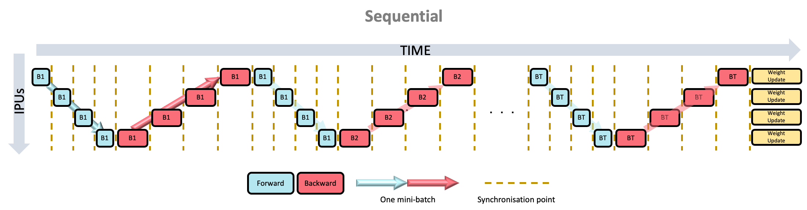

Training a model
----------------

TensorFlow XLA and Poplar provide the ability to combine an entire training
graph into a single operation in the TensorFlow graph.  This accelerates
training by removing the need to make calls to the IPU hardware for each
operation in the graph.

However, if the Python code with the training pass is called multiple
times, once for each batch in the training data set, then there is still
the overhead of calling the hardware for each batch.

The Graphcore IPU support for TensorFlow provides three mechanisms to
improve the training performance: training loops, data set feeds, and
replicated graphs.

Training loops, data sets and feed queues
~~~~~~~~~~~~~~~~~~~~~~~~~~~~~~~~~~~~~~~~~

By placing the training operations inside a loop, they can be executed multiple
times without returning control to the host.  It is possible to use a standard
TensorFlow ``while_loop`` operation to wrap the training operation, but the IPU
library provides a convenient and feature rich version.

Normally when TensorFlow runs, operations which are not inside a loop will be
executed once, and those operations will return one or more tensors with fixed
values.  However, when a training operation is placed into a loop, the inputs
to that training operation need to provide a stream of values.  Standard
TensorFlow Python feed dictionaries cannot provide data in this form, so when
training in a loop, data must be fed from a TensorFlow DataSet.

More information can be found on the DataSet class and its use in normal
operation at https://www.tensorflow.org/guide/performance/datasets. TensorFlow
provides many pre-configured DataSets for use in training models.  See the site
https://www.tensorflow.org/datasets.

To construct a system that will train in a loop, you will need to do the
following:

* Wrap your optimiser training operation in a loop.
* Create an ``IPUInfeedQueue`` to feed data to that loop.
* Create an ``IPUOutfeedQueue`` to take results out of that loop.
* Create a TensorFlow DataSet to provide data to the input queue.

The following example shows how to construct a trivial DataSet, attach it to
a model using in ``IPUInfeedQueue``, feed results into an ``IPUOutfeedQueue``, and
construct a loop.

.. literalinclude:: perf_training_example.py
  :language: python
  :linenos:

In this case the DataSet is a trivial one.  It constructs a base DataSet from a
single TensorFlow constant, and then maps the output of that DataSet into a
pair of tensors.  It then arranges for the DataSet to be repeated indefinitely.

After the DataSet is constructed, the two data feed queues are constructed. The
``IPUInfeedQueue`` takes the DataSet as a parameter.

The ``IPUOutfeedQueue`` has extra options to control how it collects and outputs
the data sent to it.  None of these are used in this example.

Now that we have the DataSet and the queues for getting data in and out of the
device-side code, we can construct the device-side part of the model.  In this
example, the ``body`` function constructs a very simple model, which does not
even have an optimiser.  It takes the two data samples which will be provided
by the DataSet, and performs some simple maths on them, and inserts the
results into the output queue.

Typically, in this function, the full ML model would be constructed and a
TensorFlow ``Optimizer`` would be used to generate a backward pass and variable
update operations.  The returned data would typically be a loss value, or
perhaps nothing at all if all we do is call the training operation.

The ``my_net`` function is where the ``loops.repeat`` function is called.  This
wraps the ``body`` function in a loop.  It takes as the first parameter the
number of times to execute the operation, in this case 10.  It also takes the
function that generated the body of the loop, in this case the function
``body``, a list of extra parameters to pass to the body, in this case none,
and finally the infeed queue which will feed data into the loop.

Next we create an IPU scope at the top level and call ``ipu_compiler.compile``
passing the ``my_net`` function, to create the training loop in the main graph.
The output of the ``ipu_compiler.compile`` will be an operation that can be
called to execute the training loop.

Finally, we create an operation which can be used to fetch results from the
outfeed queue.  Note that it isn't necessary to use an outfeed queue if you do
not wish to receive any per-sample output from the training loop.  If all you
require is the final value of a tensor, then it can be output normally without
the need for a queue.

If you run this example then you will find that the result is a Python
dictionary containing two numpy arrays.  The first is the ``d1`` array and
will contain `x1 + x2` for each iteration in the loop.  The second is the ``d2``
array and will contain `x1 - x2` for each iteration in the loop.

See entries in the :ref:`api-section` for more details.

For a more practical example, the Graphcore tutorials repository contains a `detailed tutorial about using infeeds and outfeeds with TensorFlow <https://github.com/graphcore/tutorials/tree/sdk-release-2.4/tutorials/tensorflow2/infeed_outfeed>`_.

Accessing outfeed queue results during execution
~~~~~~~~~~~~~~~~~~~~~~~~~~~~~~~~~~~~~~~~~~~~~~~~

An ``IPUOutfeedQueue`` supports the results being fetched continuously during
the execution of a model. This feature can be used to monitor the performance of
the network, for example to check that the loss is decreasing, or to stream
predictions for an inference model to achieve minimal latency for each sample.

.. literalinclude:: outfeed_example.py
  :language: python
  :linenos:

.. _replicated_graphs:

Replicated graphs
~~~~~~~~~~~~~~~~~

To improve performance, multiple IPUs can be configured to run in a data
parallel mode.  The graph is said to be replicated across multiple IPUs.
See the `Poplar and PopLibs User Guide
<https://docs.graphcore.ai/projects/poplar-user-guide/>`_ for more background
about replicated graphs.

.. note:: Replicated graphs are not supported when running on an IPU Model.

Selecting the number of replicas
________________________________

During system configuration, you specify the number of IPUs for the
TensorFlow device using the ``auto_select_ipus`` or ``select_ipus`` options on
an :py:class:`~tensorflow.python.ipu.utils.IPUConfig` instance.

A graph can be sharded across multiple IPUs (model parallelism), and then
replicated across IPUs (data parallelism).  When specifying the number of IPUs
in the system, you must specify a multiple of the number of shards used
by the graph.

For instance, if a graph is sharded over two IPUs, and you set the
``auto_select_ipus`` option to eight IPUs, then the graph will be replicated
four times.

Performing parameter updates
____________________________

Each replica maintains its own copy of the graph, but during training it is
important to ensure that the graph parameters are updated so that they are
in sync across replicas.

A wrapper for standard TensorFlow optimisers is used to add extra operations to
the parameter update nodes in the graph to average updates across replicas.
See :py:class:`tensorflow.python.ipu.optimizers.CrossReplicaOptimizer`.

.. _pipelined_training:

Pipelined training
~~~~~~~~~~~~~~~~~~

The IPU pipeline API creates a series of computational stages, where the
outputs of one stage are the inputs to the next one. These stages are then
executed in parallel across multiple IPUs. This approach can be used to
split the model where layer(s) are executed on different IPUs.

This improves utilisation of the hardware when a model is too large to fit
into a single IPU and must be sharded across multiple IPUs.

Each of the stages is a set of operations, and is described using a Python
function, in much the same way as the ``ipu.compile`` takes a function that
describes the graph to compile onto the IPU.

See :py:func:`tensorflow.python.ipu.pipelining_ops.pipeline` for details of the
pipeline operator.

The pipeline API requires data inputs to be provided by a ``tf.DataSet``
source connected via an infeed operation.  If you would like per-sample
output, for instance the loss, then this will have to be provided by an outfeed
operation.

The computational stages can be interleaved on the devices in three different
ways as described by the ``pipeline_schedule`` parameter.  By default the API
will use the ``PipelineSchedule.Grouped`` mode (:numref:`fig-pipeline-grouped`), where the forward passes are
grouped together, and the backward passes are grouped together.  The main
alternative is the ``PipelineSchedule.Interleaved`` mode (:numref:`fig-pipeline-interleaved`), where the forward and
backward passes are interleaved, so that fewer activations need to be stored. Additionally, the ``PipelineSchedule.Sequential`` mode (:numref:`fig-pipeline-sequential`),
where the pipeline is scheduled in the same way as if it were a sharded model,
may be useful when debugging your model.

For more information on pipelining, refer to the technical note on `Model parallelism with TensorFlow: sharding and pipelining <https://docs.graphcore.ai/projects/tf-model-parallelism/>`_.

Grouped scheduling
__________________

.. figure:: figures/grouped_pipeline.png
    :width: 95%
    :alt: Grouped pipeline schedule illustration
    :align: center
    :name: fig-pipeline-grouped

    Grouped scheduling

Interleaved scheduling
______________________

.. figure:: figures/interleaved_pipeline.png
    :width: 95%
    :alt: Interleaved pipeline schedule illustration
    :align: center
    :name: fig-pipeline-interleaved

    Interleaved scheduling

Sequential scheduling
_____________________

    Sequential scheduling

Pipeline stage inputs and outputs
_________________________________

The first pipeline stage needs to have inputs which are a combination of the
tensors from the DataSet, and the tensors given as arguments to the
pipeline operation.  Any data which changes for every sample or minibatch of
the input should be included in the DataSet, while data which can vary only
on each run of the pipeline should be passed as arguments to the pipeline
operation.  Parameters like the learning rate would fit into this latter case.

Every subsequent pipeline stage must have its inputs as the outputs of the
previous stage.  Note that things like the learning rate must be threaded
through each pipeline stage until they are used.

Applying an optimiser to the graph
__________________________________

The optimiser must be applied by creating it in a special optimiser function
and then returning a handle to it from that function.  The function is passed
into the ``optimizer_function`` argument of the pipeline operation.

When a pipeline is running it will accumulate the gradients from each step of
the pipeline and only apply the updates to the graph parameters at the end of
each pipeline run, given by the ``gradient_accumulation_count`` parameter.
Consequently it is important for the system to have more knowledge of the
optimiser and so it must be given to the pipeline operator using this function.

Device mapping
______________

By default the pipeline operation will map the pipeline stages onto IPUs in
order to minimise the inter-IPU communication lengths.  If you need to
override this order, then you can use the ``device_mapping`` parameter.

Concurrent pipeline stages
__________________________

When pipelining a model, it's possible to have stages that have no data
dependencies and don't share weights. These stages can benefit from operating
on the same mini-batch concurrently.

    An example pipeline with stages (lettered boxes) processing multiple
    mini-batches (colours of the stages). The flow of a single mini-batch is
    highlighted at the bottom.

These concurrent pipeline stages are defined by providing a list of stages.
The corresponding element of the device-mapping should also be a list. The
argument list to each concurrent stage must be the same, including any
arguments coming from an infeed. The input to the next stage, or outfeed,
is the concatenation of concurrent stage outputs.

.. code-block:: python

  def stage1a(args...):
    # ... do stuff on IPU 1
    return a0, a1, ...
  def stage1b(args...):
    # ... do stuff on IPU 2
    return b0, b1, ...

  # stage 2 arguments are a concatenation of the results of the previous
  # concurrent stages.
  def stage2(a0, a1, ..., b0, b1, ...):
    # ... do stuff on IPU 2

  pipeline_op = pipelining_ops.pipeline(
    # Second element of the list is also a list of functions.
    computational_stages=[stage0, [stage1a, stage1b], stage2, stage3],
    # ...
    # Second element of the list is also a list of device IDs.
    device_mapping=[0, [1, 2], 2, 3])

Comparing this to a pipeline not using this feature where the activations are
passed through stages, the pipeline is shorter. This means that
fewer activations are stored over the whole execution of the pipeline and the
expected latency is lower than the serialised pipeline.

    Comparison of the same logical pipelines with concurrent stages (top) and
    without (bottom).

.. _gradient-accumulation:

Gradient accumulation
~~~~~~~~~~~~~~~~~~~~~

Gradient accumulation is a technique for increasing the effective batch size
by processing multiple batches of training examples before updating the model.
The gradients from each batch are accumulated and these accumulated gradients
are used to compute the weight update.
When gradient accumulation is used, the effective batch size of the model is the
number of mini-batches for which the gradients are accumulated multiplied by
the mini-batch size.

Gradient accumulation is a useful optimisation technique for replicated graphs
as it reduces the number of times the gradients are exchanged between replicas
by a factor of the number of mini-batches. This is because the gradients only need
to be exchanged between replicas when the weight update is computed.
When gradient accumulation is used with replication, the effective batch size of
the model is the number of mini-batches for which the gradients are
accumulated multiplied by the mini-batch size multiplied by the replication
factor.

The choice of gradient accumulation count impacts the time spent in the ramp-up
and ramp-down stages of pipeline execution. As the gradient accumulation
count increases, the proportion of cycles spent on the ramp-up/ramp-down phases
decreases, with respect to the total number of cycles required to process the batch.
As weight updates are performed after the ramp-down phase, a higher gradient accumulation
count also results in a smaller proportion of cycles spent on weight updates.

There are multiple convenient ways to use gradient accumulation with minimal
modifications to your model.

Optimizers
__________

Gradient accumulation optimizers provide an easy way to add gradient
accumulation to your model:

* :class:`~tensorflow.python.ipu.optimizers.GradientAccumulationOptimizerV2`
  is a general purpose optimizer which can be used to wrap any other TensorFlow
  optimizer. It supports optimizer state offloading (see the
  :ref:`optimiser-state-unloading` section).

* :class:`~tensorflow.python.ipu.optimizers.GradientAccumulationOptimizer`
  is an optimizer which can be used to wrap `tf.train.GradientDescentOptimizer`
  and `tf.train.MomentumOptimizer` only. Note that this optimizer does **not**
  support optimizer state offloading.

The cross-replica versions of these optimizers can be used with replicated
graphs, see
:class:`~tensorflow.python.ipu.optimizers.CrossReplicaGradientAccumulationOptimizerV2`
and
:class:`~tensorflow.python.ipu.optimizers.CrossReplicaGradientAccumulationOptimizer`.

.. note:: These optimizers need to be used inside of a training loop generated
  by :func:`~tensorflow.python.ipu.loops.repeat`.

Pipelining
__________

All pipelined training graphs automatically apply gradient accumulation to the
model such that the weight update is only computed once all the mini-batches have
gone through the whole model pipeline, where the number of mini-batches is the
``gradient_accumulation_count``.

.. Note:: Since the pipelined models always implement gradient accumulation, no
  gradient accumulation optimizer should be used in combination with pipelining.

Accumulation data type
______________________

When accumulating gradients over a large number of mini-batches, it can be
beneficial to perform the accumulation in a data type with higher precision
(and dynamic range) than that of the gradients. By default, the accumulation is
performed using the same data type as the corresponding variable, but this can
be overridden by passing ``gradient_accumulation_dtype`` (or just ``dtype`` to
the ``GradientAccumulationOptimizerV2``).

This argument can be either of these three options:

- `None`: Use an accumulator of the same type as the variable type.
- A `DType`: Use this type for all the accumulators. For example `tf.float32`.
- A callable that takes the variable and returns a `DType`: Allows
  specifying the accumulator type on a per-variable basis. For example, passing
  ``lambda var: var.dtype`` would have the same effect as passing `None`.

Note that when accumulating the gradients using a different data type than that
of the variable, an standard optimizer will not work since there will be a data
type mismatch between the accumualated gradient and the variable when doing the
weight update. You can use a custom optimizer to cast the final accumulated
gradient to the data type of the variable before performing the weight update,
for example like this with a Keras SGD optimizer:

.. code-block:: python

  class CastGradientsSGD(tf.keras.optimizers.SGD):
    def apply_gradients(self, grads_and_vars, name=None):
      cast_grads_and_vars = [(tf.cast(g, v.dtype), v)
                             for (g, v) in grads_and_vars]
      return super().apply_gradients(cast_grads_and_vars, name)

.. _optimiser-state-unloading:

Optimizer state offloading
~~~~~~~~~~~~~~~~~~~~~~~~~~

Some optimizers have an optimizer state which is only accessed and modified
during the weight update. For example the ``tf.MomentumOptimizer`` optimizer has
accumulator variables which are only accessed and modified during the weight
update.
This means that when gradient accumulation is used, whether through the use of
pipelining or the
:class:`~tensorflow.python.ipu.optimizers.GradientAccumulationOptimizerV2`
optimizer, the optimizer state variables do not need to be stored in the device
memory during the forward and backward propagation of the model. These variables
are only required during the weight update and so they are streamed onto the
device during the weight update and then streamed back to remote memory after
they have been updated.

This feature is enabled by default for both pipelining and when
:class:`~tensorflow.python.ipu.optimizers.GradientAccumulationOptimizerV2`
is used.

It can be disabled by setting the ``offload_weight_update_variables`` argument
of :func:`~tensorflow.python.ipu.pipelining_ops.pipeline` or
:class:`~tensorflow.python.ipu.optimizers.GradientAccumulationOptimizerV2`
to ``False``.

This feature requires the machine to be configured with support for
Poplar remote buffers and if the machine does not support it, it is disabled.

Offloading variables into remote memory can reduce maximum memory liveness, but
it can also increase the computation time of the weight update as more time is
spent communicating with the host.

Dataset benchmarking
~~~~~~~~~~~~~~~~~~~~
In order to fully utilise the potential of the IPU, the ``tf.data.Dataset`` used
by the ``IPUInfeedQueue`` needs to be optimised so that the IPU is not constantly
waiting for more data to become available.

To benchmark your ``tf.data.Dataset``, you can make use of the
``ipu.dataset_benchmark`` tool.
See :py:mod:`tensorflow.python.ipu.dataset_benchmark` for details of the
functions that you can use to obtain the maximum throughput of your
``tf.data.Dataset``.

If the throughput of your ``tf.data.Dataset`` is the bottleneck, you can try to
optimise it using the information on the TensorFlow website:

* https://www.tensorflow.org/guide/data
* https://www.tensorflow.org/guide/data_performance

Accessing the JSON data
_______________________

The functions in ``ipu.dataset_benchmark`` return a JSON string which can
be loaded into a JSON object using the native JSON library, for example:

.. code-block:: python

  import tensorflow as tf
  from tensorflow.python import ipu
  import json

  # Create your tf.data.Dataset
  dataset = ...
  benchmark_op = ipu.dataset_benchmark.dataset_benchmark(dataset, 10, 512)

  with tf.Session() as sess:
      json_string = sess.run(benchmark_op)
      json_object = json.loads(json_string[0])
