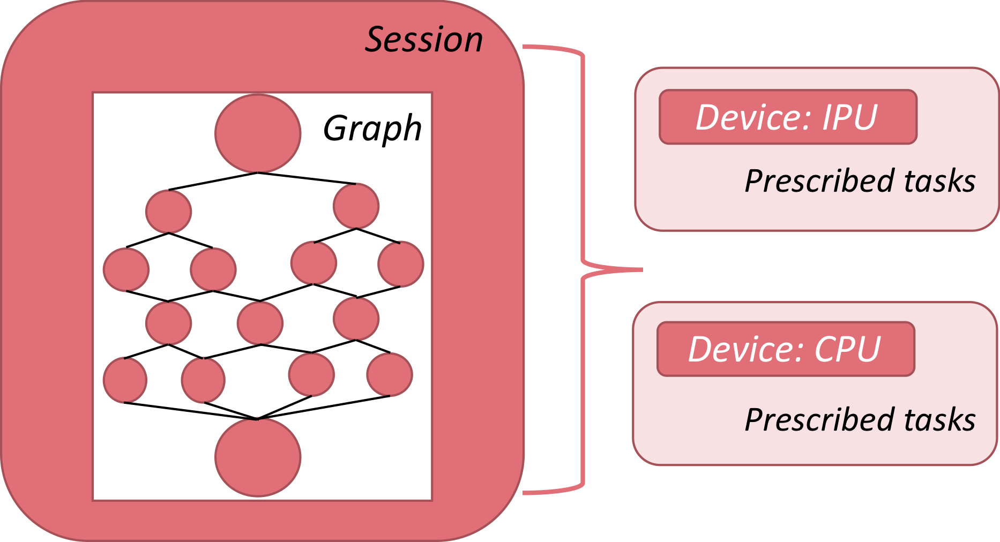
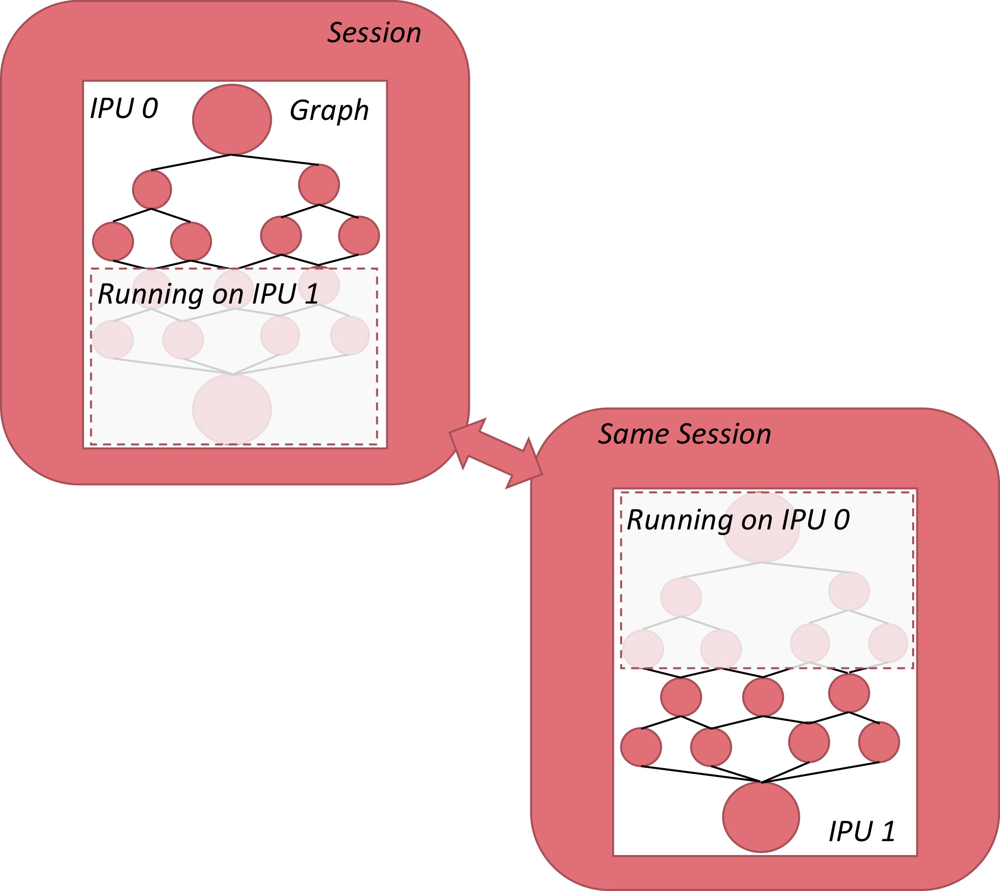

.. _tutorial:

Tutorial
--------

For the discussion that follows, it is important to understand the three key
concepts of *graph*, *session* and *device* as well as their functional
interdependence.

    Relationship between session, graph and device in TensorFlow

* **Graph**: A computational graph is the connectivity framework of a deep learning
  model, where nodes are operators and edges are the data streams that connect
  them. Building a deep learning model in TensorFlow is the functional
  equivalent of designing a graph, where specified layer operations (for example,
  fully-connected layers) are nodes, and the sequence and connectivity of
  layers (such as a convolutional layer followed by max-pooling) define the
  edges.

* **Session**:
  A session is the computational platform that encapsulates a graph. It
  handles data flow into and out of the graph, variable initialisation,
  model/weight storage and weight restoration, along with a number of other
  operations that are required to manage the computational task.

* **Device**:
  The device identifies the hardware on which a session
  is run, such as the IPU, CPU or TPU. In many of the applications targeting
  the IPU, it will be helpful to segregate tasks between the CPU and IPU to
  leverage those aspects of the computation that they are each best suited
  for.

In the sections that follow, these three concepts will form a recurrent theme in
building and deploying models from TensorFlow.

There are a number of references, user guides, model repositories and texts that can
be valuable in learning the framework. See the :ref:`references-section`
section for further reading.

Preliminary graphs
~~~~~~~~~~~~~~~~~~

The focus now is to implement our first basic graphs targeting the IPU. The
first step will be a straightforward additive graph with nothing save the
fundamental components required for running on an IPU.

From there, we add the
XLA library, which is required for a number of TensorFlow operators.

Finally, we add the concept of *sharding*, in which we take our first steps to
model parallelism by splitting a basic graph across four IPUs then consolidate
the calculations from the separate IPUs to produce a single final result.

A basic graph
~~~~~~~~~~~~~

We begin with a simple example of adding some floating-point numbers.

.. literalinclude:: tutorial_basic.py
    :language: python
    :linenos:
    :emphasize-lines: 3,4,8-11,13-16,19-24,27

Let's review the key sections of the code. In
lines 1-5 are the basic import statements, two of which pertain to the IPU
specifically. Line 3 imports the IPUConfig configuration API, which will be the
main interface to set configuration options for running the IPU session.
``ipu_scope`` is a helper function that ensures that the device and resource
scopes are set (that is, that the hardware is properly initialised when called
by the script).

.. literalinclude:: tutorial_basic.py
    :language: python
    :linenos:
    :lineno-start: 8
    :start-at: # Configure arguments for targeting the IPU
    :end-at: cfg.configure_ipu_system()

In this section of the code, basic configuration options are being defined.
The ``IPUConfig`` is a hierarchical structure of configuration options,
organized into categories. To set a configuration option, assign to one of its
attributes.

Selecting hardware to run on
............................

The ``auto_select_ipus`` option enables you to select from the available IPUs
in a system. In this example, one IPU is selected. This can be changed
to any number between 1 and the number of IPUs available in your system.
For example, the Dell EMC DSS8440 IPU Server has eight C2 cards installed, each
with two IPUs, so it has 16 IPUs available in total.

This option will be important when we
explore sharding, in which a single graph is segregated into separate sections,
each section targeting a distinct IPU.

.. literalinclude:: tutorial_basic.py
    :language: python
    :start-at: with tf.device("cpu"):
    :end-at: pc = tf.placeholder
    :lineno-start: 14
    :linenos:

In this section, TensorFlow placeholders are being placed into the CPU part of
the graph.  These will be used to feed data using a feed dictionary when
executing ``session.run()``.

.. literalinclude:: tutorial_basic.py
    :language: python
    :start-at: def basic_graph(pa, pb, pc):
    :end-at: result = basic_graph(pa, pb, pc)
    :lineno-start: 20
    :linenos:

In this section, a graph of operations is created to do simple arithmetic on
three input tensors.  The ``ipu_scope`` directive is used to ensure that these
operations are placed on the IPU system.

Then the graph is executed by using ``session.run()``, the following output can
be seen in the console log:

.. code-block:: text

    ... [VARIOUS OUTPUT LINES FROM SCRIPT]...
    ...: I tensorflow/compiler/plugin/poplar/driver/executor.cc:660] Device /device:IPU:0 attached to IPU: 0
    [3. 8.]

The last line shows the result of adding the vectors. The line before that informs us
that the targeted device was the IPU, and the index of the IPU that ran
the graph was IPU 0.

Note that ``"/device:IPU:0"`` in the script is a logical
identifier for the IPU, and so when using ``auto_select_ipus``, the actual IPU
selected to run the graph may not be IPU 0, but could be any of
the other IPUs that are free and available on the server. This will be covered
in more detail in :ref:`sharding_a_graph`.

Running on the IPU Model simulator
..................................

You can also run the graph on an "IPU Model" running on the host.
The IPU Model is a simulation of the *behaviour* of the IPU hardware.
It does not implement every aspect of a real IPU.

When using an IPU Model instead of actual IPU hardware, the runtime operations
will behave exactly as they would on hardware. However, the profiler will
*estimate* the performance of operations and memory use, so the profiling
information will not be as precise as running on hardware.
By default, the memory use will not include that required for IPU
code.

If you set the ``IPUConfig.ipu_model.compile_ipu_code`` option to
``True`` then Poplar will compile code for the IPU (in addition to the CPU code
that is actually executed by the IPU Model). In this case, the reported
IPU memory usage will include the memory used for code.

The IPU Model can be a useful tool for debugging OOM-related issues.

By default, the code will be run on IPU hardware. To run on the
IPU Model instead, you need to set the environment variable
``TF_POPLAR_FLAGS='--use_ipu_model'``, for example:

.. code-block:: python

    # Make sure we append to the environment variable, in case there are
    # already other flags in there.
    os.environ['TF_POPLAR_FLAGS'] = os.environ.get('TF_POPLAR_FLAGS', '') + ' --use_ipu_model'

Compiling the graph for the IPU
~~~~~~~~~~~~~~~~~~~~~~~~~~~~~~~~

XLA (Accelerated Linear Algebra) is a domain-specific compiler for linear
algebra that can accelerate TensorFlow models. The Graphcore implementation
generates code optimised for the IPU.

The main interface to XLA is the ``ipu.ipu_compiler.compile()`` function,
which will take a graph and a feed dictionary for input tensors, and
return a tensor set. ``ipu.ipu_compiler.compile()`` sits between the graph
definition and the session construct, as shown below:

.. note::
    To ensure that your code is executed efficiently on the IPU, you should compile
    it with ``ipu.ipu_compiler.compile()``. For operations that are to be placed on
    an IPU, this should be called inside an ``ipu_scope``.

Let's now build on our previous TensorFlow script by adding
``ipu.ipu_compiler.compile`` to the session definition.

.. literalinclude:: tutorial_xla_compile.py
    :language: python
    :linenos:
    :emphasize-lines: 29

The script has now gone from calling ``basic_graph`` directly, to feeding it as
the graph input to ``ipu.ipu_compiler.compile()``. This takes the graph, along with
the corresponding placeholders, as input.

Using XLA has certain restrictions, the most relevant of which is that the
dimensions of all tensors involved in the graph must be fully defined at compile
time.

As a result, the dimensions of the placeholders fed to
``ipu.ipu_compiler.compile()`` have been defined on the CPU. The *values* of these
tensors are not defined until the ``session.run()`` call.

In most IPU-specific implementations, it is likely that an entire graph will be
parsed through ``ipu.ipu_compiler.compile()``. However, it is also possible to
compile only a portion of a graph with XLA and then combine the resulting tensor
set with another, non-XLA, graph.

Further details about XLA compilation are available on the TensorFlow website:
https://www.tensorflow.org/xla/.

.. _sharding_a_graph:

Sharding a graph
~~~~~~~~~~~~~~~~

The final script of this introductory series focuses on sharding: the process of
splitting a graph across multiple IPUs. In essence, the session continues to be
a single entity, so that the graph construct is treated as a single model, but
distinct portions of the graph live on different IPUs, as illustrated below:

    Sharding across two IPUs

Let's now return to our basic script and add the sharding component.

.. literalinclude:: tutorial_sharding.py
    :language: python
    :linenos:
    :emphasize-lines: 10,14,29-38,43

Focusing on the sharding parts of this new script, line 14 uses
``auto_select_ipus`` to select four separate IPUs for the task. This will
go through the IPUs accessible by the host, determine which
are being utilised and which are free, and then subscribe to those IPUs that are
available.

In lines 29-38, the standard sum graph is defined (with the addition of one
more sum on shard 2). Now each portion of the sum is performed on a
distinct shard, using

.. code-block:: python

    with ipu.scopes.ipu_shard(shard_index):

As a result, shards 0 through 2 perform independent tensor sums, while shard
3 performs an accumulated sum from the other three shards. In line 43
we are using ``ipu.ipu_compiler.compile()`` to parse the graph.

The output of the session run will be something similar to this:

.. code-block:: none

    ... [VARIOUS OUTPUT LINES FROM SCRIPT]...
    ...:  I tensorflow/compiler/plugin/poplar/driver/executor.cc:660] Device /device:IPU:0 attached to IPUs: 24
    [array([ 4., 14.], dtype=float32)]

The first thing to note is that the sum is correct so we know that the sharded
implementation works correctly.

The second thing to note is that the IPU ID is reported as 24. This is a
*multi-IPU* ID and corresponds to the individual IPUs 4, 5, 6 and 7.
These are the IPUs selected to host the graph and to process respective shards
as indexed in the code. See the `IPU Command Line Tools
<https://docs.graphcore.ai/projects/command-line-tools/>`_ document for
more information about how IPU IDs are allocated.

Adding variables
~~~~~~~~~~~~~~~~

Do not add variables using ``tf.Variable([shape], initializer)``, because they will fail
to obey certain operations, such as ``assign_add``.

Make sure that all variables are added using a variable scope that is marked as
a resource. This can be done globally, as shown below:

.. code-block:: python

  vscope = tf.get_variable_scope()
  vscope.set_use_resource(True)
  ...
  var = tf.get_variable(name, shape=[...], dtype=tf.float32, initializer=tf.constant_initializer(0.5))
  ...

Or it can be done locally, in a specific scope:

.. code-block:: python

  with tf.variable_scope("vs", use_resource=True):
    var = tf.get_variable(name, shape=[...], dtype=tf.float32, initializer=tf.constant_initializer(0.5))

Troubleshooting
...............

If you get an error similar to the following (especially the lines containing
``VariableV2``) it indicates that a variable has been created which is not a
resource variable.

.. code-block:: none

    InvalidArgumentError (see above for traceback): Cannot assign a device for operation
      'InceptionV1/Logits/Conv2d_0c_1x1/biases': Could not satisfy explicit device specification
      '/device:IPU:0' because no supported kernel for IPU devices is available.
    Colocation Debug Info:
    Colocation group had the following types and devices:
    Const: CPU IPU XLA_CPU
    Identity: CPU IPU XLA_CPU
    Fill: CPU IPU XLA_CPU
    Assign: CPU
    VariableV2: CPU

Note on the global_step counter
...............................

More advanced execution control frameworks in TensorFlow use a scalar counter
called ``global_step`` to count the number of iterations of training which have
occurred. This counter is serialised along with the model. It allows the model
to base parameters on the step count, even if the model is run multiple times.

There is an ``add`` operation which adds to the ``global_step`` scalar on each
training pass.  If the ``global_step`` variable is placed on the IPU device,
then this increment operation will occur on the IPU too.  This will cause the
Poplar training engine to be swapped out for the increment engine on each
training step, causing very poor performance.

To avoid this, use the expression
``tf.train.get_or_create_global_step()`` in the CPU context before you create any special training
sessions. This will ensure that the global_step variable is on the CPU.

.. code-block:: python

  with tf.device("cpu"):
    tf.train.get_or_create_global_step()

  with ipu.scopes.ipu_scope("/device:IPU:0"):
    out = ipu.ipu_compiler.compile(model_fn, [...])
