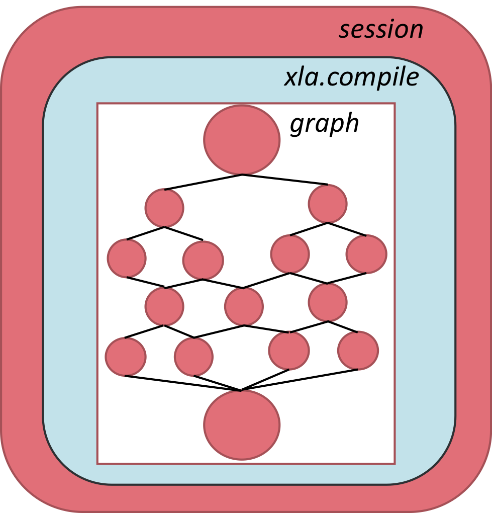

Tutorial
--------

TensorFlow is a powerful graph-modelling framework that can be used for the
development, training and deployment of deep learning models. In the Graphcore
software stack, TensorFlow sits at the highest level of abstraction. Poplar
and PopLibs provide a software interface to operations running on the IPU.

.. figure:: figures/Tensorflow_Poplar.png
    :width: 100%
    :alt: TensorFlow abstraction
    :align: center

    TensorFlow abstraction in relation to Poplar and the IPU

For the discussion that follows, it is important to understand the three key
concepts of *graph*, *session* and *device* as well as their functional
interdependence.

.. figure:: figures/Session_Graph.png
    :width: 70%
    :alt: Session graph device illustration
    :align: center

    Relationship between session, graph and device in TensorFlow

* **Graph**: A computational graph is the connectivity framework of a deep learning
  model, where nodes are operators and edges are the data streams that connect
  them. Building a deep learning model in TensorFlow is the functional
  equivalent of designing a graph, where specified layer operations (for example,
  fully-connected layers) are nodes, and the sequence and connectivity of
  layers (such as a convolutional layer followed by max-pooling) define the
  edges.

* **Session**:
  A session is the computational platform that encapsulates a graph. It
  handles data flow into and out of the graph, variable initialisation,
  model/weight storage and weight restoration, along with a number of other
  operations that are required to manage the computational task.

* **Device**:
  The device identifies the hardware on which a session
  is run, such as the IPU, CPU or TPU. In many of the applications targeting
  the IPU, it will be helpful to segregate tasks between the CPU and IPU to
  leverage those aspects of the computation that they are each best suited
  for.

In the sections that follow, these three concepts will form a recurrent theme in
building and deploying models from TensorFlow.

There are a number of references, user guides, model repositories and texts that can
be valuable in learning the framework. See the :ref:`references-section`
section for further reading.

Preliminary graphs
~~~~~~~~~~~~~~~~~~

The focus now is to implement our first basic graphs targeting the IPU. The
first step will be a straightforward additive graph with nothing save the
fundamental components required for running on an IPU.

From there, we add the
XLA library, which is required for a number of TensorFlow operators.

Finally, we add the concept of *sharding*, in which we take our first steps to
model parallelism by splitting a basic graph across four IPUs then consolidate
the calculations from the separate IPUs to produce a single final result.

A basic graph
~~~~~~~~~~~~~

We begin with the most humble of aspirations: the ability to add.

.. literalinclude:: tutorial_basic.py
    :language: python
    :linenos:

Let's review the various key sections of the code as they are presented. In
lines 1-5 are the basic import statements, two of which pertain to the IPU
specifically. Line 3 imports the IPU API, which will be the main interface
to set configuration options for running the IPU session. ``ipu_scope`` is a helper
function that ensures that the device and resource scopes are set (that is,
that the hardware is properly initialised when called by the script).

.. literalinclude:: tutorial_basic.py
    :language: python
    :start-at: # Configure arguments for targeting the IPU
    :end-at: ipu.utils.configure_ipu_system

In this section of the code basic configuration options are being defined.
Boolean flags are passed to ``create_ipu_config``, which turn on
profiling and a text-format report.

* The ``profiling`` parameter enables trace event
  logging on the IPU. This will monitor operations on the chip, providing
  detailed data about the session as it runs on
  hardware.

* ``use_poplar_text_report`` configures the text format
  of the generated report, making it more readable for debugging purposes.

Because profiling adds code and extra variables to extract the profiling
information, it can change the performance and memory usage of your program.

Running on the IPU Model simulator
..................................

You can run the graph on IPU hardware or on an IPU Model running on the host.
The IPU Model is a simulation of the *behaviour* of the IPU hardware.
It does not implement every aspect of a real IPU. For example, the
IPU Model does not support replicated graphs in TensorFlow
(see :ref:`replicated_graphs`).

When using an IPU Model instead of actual IPU hardware, the runtime operations
will behave exactly as they would on hardware. However, the profiler will
*estimate* the performance of operations and the memory use so the profiling
information will not be as precise as running on hardware.
By default, the memory use will not include that required for IPU
code.

If you set the ``set_ipu_model_options`` option ``compile_ipu_code`` to
``True`` then Poplar will compile code for the IPU (in addition to the CPU code
that is actually executed by the host). In this case, the reported
IPU memory usage will include the memory used for code.

The IPU Model can be a useful tool for debugging OOM-related issues.
See :ref:`using_the_ipu_model` for more information.

By default, the code will be run on IPU hardware. To run on the
IPU Model instead, you need to set the environment variable
``TF_POPLAR_FLAGS='--use_ipu_model'``, for example:

.. code-block:: python

    # Using IPU model instead of IPU hardware
    if self.base_dictionary['ipu_model']:
        os.environ['TF_POPLAR_FLAGS'] = '--use_ipu_model'

Selecting hardware to run on
............................

The ``auto_select_ipus`` function enables you to select from the available IPUs
in a system. In this example, one IPU is selected. This can be changed
to any number between 1 and 16 for a system, such as the Dell EMC
DSS8440 IPU Server which has eight C2 cards installed, each with two IPUs.

This option will be important when we
explore sharding, in which a single graph is segregated into separate sections,
each section targeting a distinct IPU.

.. literalinclude:: tutorial_basic.py
    :language: python
    :start-at: with tf.device("cpu"):
    :end-at: pc = tf.placeholder

In this section, TensorFlow placeholders are being placed into the CPU part of
the graph.  These will be used to feed data using a feed dictionary when
executing ``session.run()``.

.. literalinclude:: tutorial_basic.py
    :language: python
    :start-at: def basic_graph(pa, pb, pc):
    :end-at: result = basic_graph(pa, pb, pc)

In this section, a graph of operations is created to do simple arithmetic on
three input tensors.  The ``ipu_scope`` directive is used to ensure that these
operations are placed on the IPU system.

Then the graph is executed by using ``session.run()``, the following output can
be seen in the console log:

.. code-block:: text

    ... [VARIOUS OUTPUT LINES FROM SCRIPT]...
    ...: I tensorflow/compiler/plugin/poplar/driver/executor.cc:660] Device /device:IPU:0 attached to IPU: 0
    [3. 8.]

Beyond summing the vectors correctly, the line directly preceding informs us
that the targeted device was the IPU, and the index of the IPU that ran
the graph was IPU 0.

Note that ``"/device:IPU:0"`` in the script is a logical
identifier for the IPU, and so when using ``auto_select_ipus``, the actual IPU
selected to run the graph may not be IPU 0, but could be any of
the other IPUs that are free and available on the server. This will be covered
in more detail in :ref:`sharding_a_graph`.

An XLA graph
~~~~~~~~~~~~

The previous script introduced a very basic graph that consisted of the
summation of
three vectors and published the results of a forward pass. For certain
applications, it will be necessary to incorporate control flow structures, as in
conditional ``if`` or ``while`` statements. Certain recurrent
neural network (RNN) layers and long-short term memory (LSTM) cells have
conditionals implicitly defined in their source code. In those cases, it will be
necessary to use the XLA library to define the graph. XLA is an optimised
linear algebra library that interfaces the graph to a set of optimisation
parsers that render highly efficient computation sets.

Using XLA has certain restrictions, the most pertinent of which for the
current discussion is that the dimensions of all tensors involved in the
computational graph must be fully defined at compile time. Dealing with this
restriction can at times require some meticulous refactoring of placeholders or
input tensors (especially when dealing with mini-batch processing) but does
not constitute a significant development overhead.

The main interface to the XLA library is ``ipu.ipu_compiler.compile()``,
which will take a graph and a feed dictionary for input tensors, and
return a tensor set. ``ipu.ipu_compiler.compile`` sits between the graph
definition and the session construct, as shown below:

    ``xla.compile`` in relation to a session and graph

In most IPU-specific implementations, it is likely that an
entire graph will be parsed through ``ipu.ipu_compiler.compile``. However, it is also
possible to compile only a portion of a graph with XLA and then combine the resulting
tensor set with another, non-XLA, graph.

Further details about
XLA compilation are available on the TensorFlow website:
https://www.tensorflow.org/xla/tutorials/xla_compile.

Let's now build on our previous TensorFlow script by adding
``ipu.ipu_compiler.compile`` to the session definition.

.. literalinclude:: tutorial_xla_compile.py
    :language: python
    :linenos:

The script has now gone from calling ``basic_graph`` directly, to feeding it as
the graph input to ``ipu.ipu_compiler.compile``. This takes the graph, along with
the corresponding placeholders, as input.

Note that the dimensions of the placeholders fed to ``ipu.ipu_compiler.compile``
have been defined on the CPU. The *values* of these tensors are not
defined until the ``session.run`` call.

In other words, it is only the *dimensions* of the placeholders that are the
critical information for ``ipu.ipu_compiler.compile`` so that it can parse
the graph correctly at compile time.

Given that this graph and the one in the previous example are the same, it
is apparent that ``ipu.ipu_compiler.compile`` is not actually required to
execute the graph. However, if the following code:

.. code-block:: python

    def basic_graph(pa, pb, pc):
        # Do basic addition on tensors
        o1 = pa + pb
        o2 = pa + pc
        simple_graph_output = o1 + o2
        return simple_graph_output

Were to be replaced with:

.. code-block:: python

    def while_loop_graph(pa):
            c = tf.constant(0)

            def body_of_while_loop(i):
                return i+1

            cond = lambda i: i < 10
            loop = tf.while_loop(cond, body_of_while_loop, [c])
            square = pa * pa
            return loop, square, tf.no_op()

Then ``ipu.ipu_compiler.compile`` would be strictly required, because of the use
of the ``tf.while_loop()`` conditional statement.

.. _sharding_a_graph:

Sharding a graph
~~~~~~~~~~~~~~~~

The final script of this introductory series focuses on sharding: the process of
splitting a graph across multiple IPUs. In essence, the session continues to be
a single entity, so that the graph construct is treated as a single model, but
distinct portions of the graph live on different IPUs, as illustrated below:

.. figure:: figures/Session_Graph_Sharding.png
    :width: 70%
    :alt: Sharding across two IPUs
    :align: center

    Sharding across two IPUs

Let's now return to our basic script and add the sharding component.

.. literalinclude:: tutorial_sharding.py
    :language: python
    :linenos:

Focusing on the sharding parts of this new script, line 14 uses
``auto_select_ipus`` to select four separate IPUs for the task. This will allow the
script to go through the IPUs accessible by the host, determine which
are being utilised and which are free, and then subscribe to those IPUs that are
available.

In lines 29-38, the standard sum graph is defined (with the addition of one
more sum on shard 2). Now each portion of the sum is performed on a
distinct shard, using

.. code-block:: python

    with ipu.scopes.ipu_shard(shard_index):

As a result, shards 0 through 2 perform independent tensor sums, while shard
3 performs an accumulated sum from the other three shards. In line 43
we are using ``xla.compile`` to parse the graph.

Note that sharding can
also be performed without running through the XLA library.

The output of the session run will be something similar to this:

.. code-block:: none

    ... [VARIOUS OUTPUT LINES FROM SCRIPT]...
    ...:  I tensorflow/compiler/plugin/poplar/driver/executor.cc:660] Device /device:IPU:0 attached to IPUs: 24
    [array([ 4., 14.], dtype=float32)]

The first thing to note is that the sum is correct so we know that the sharded
implementation works correctly.

The second thing to note is that the IPU ID is reported as 24. This is a
*multi-IPU* ID and corresponds to the individual IPUs 4, 5, 6 and 7.
These are the IPUs selected to host the graph and to process respective shards
as indexed in the code. See the `IPU Command Line Tools
<https://docs.graphcore.ai/projects/command-line-tools/>`_ document for
more information about how IPU IDs are allocated.
